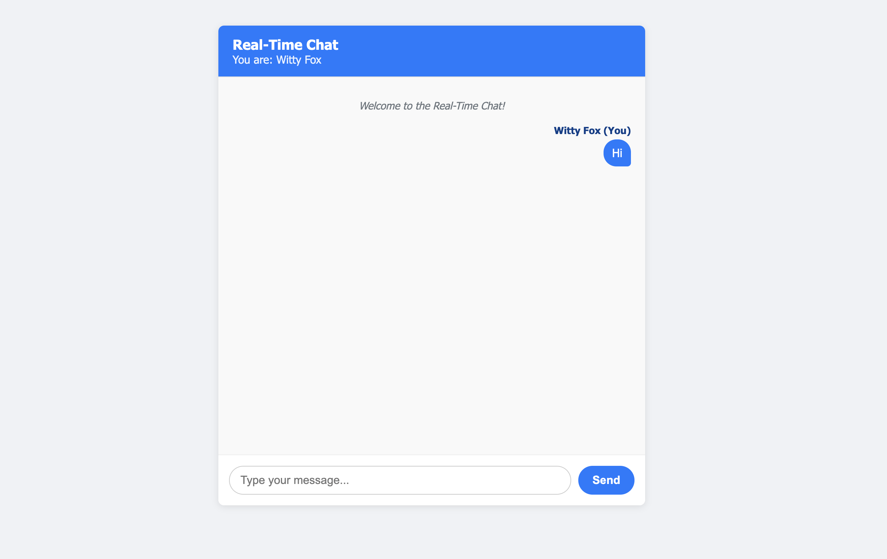

# 🚀 LiveChat: Real-Time Chat with Node.js & WebSockets


---

## ✨ Overview

LiveChat is a simple yet functional real-time chat application built using Node.js and the native WebSocket API (via the `ws` library on the server). It demonstrates the power of WebSockets for instant bi-directional communication, allowing multiple users to join and exchange messages live without page refreshes.

When you first join, you'll be prompted for a username, which is then stored locally so you don't have to enter it every time!

This project serves as a great starting point for understanding WebSocket fundamentals and building interactive web applications.

---

## 🌟 Features

*   **Real-Time Messaging:** Messages appear instantly for all connected users.
*   **WebSocket Communication:** Efficient, low-latency communication channel.
*   **Username Prompt:** Asks for a username on the first visit using a modal popup.
*   **Local Storage:** Remembers your username across sessions.
*   **Group Chat:** All connected users share the same chat room.
*   **Simple & Clean UI:** Basic interface focused on the chat experience.
*   **Auto-Scroll:** Chatbox scrolls down automatically for new messages (if you're already near the bottom).
*   **System Messages:** Basic connection/disconnection notifications (client-side).

---

## 💻 Technology Stack

*   **Backend:** [Node.js](https://nodejs.org/)
*   **WebSocket Server:** [`ws`](https://github.com/websockets/ws) library
*   **HTTP Server:** Node.js `http` module (for serving HTML & WebSocket upgrades)
*   **Frontend:** HTML5, CSS3, JavaScript (ES6+)
*   **WebSocket Client:** Native Browser `WebSocket` API
*   **Auto Browser Open:** [`open`](https://github.com/sindresorhus/open) library (for convenience during development)

---

## 🛠️ Setup & Installation

To run this project locally, follow these steps:

1.  **Clone the repository:**
    ```bash
    git clone https://github.com/MegtonLabs/Chat-Application.git
    cd Chat-Application
    ```
    *(Replace `MegtonLabs` and `Chat-Application`)*

2.  **Install dependencies:**
    You need [Node.js](https://nodejs.org/) and npm (which comes with Node.js) installed.
    ```bash
    npm install
    ```
    *(This installs `ws` and `open`)*

---

## ▶️ Running the Application

1.  **Start the server:**
    ```bash
    node server.js
    ```

2.  **Access the chat:**
    *   The script will automatically attempt to open the chat application in your default web browser at `http://localhost:8080`.
    *   If it doesn't open automatically, manually navigate to `http://localhost:8080`.

3.  **Enter Username:** If it's your first time, a modal popup will ask for your username.

4.  **Chat!**
    *   Open another browser tab or window and navigate to `http://localhost:8080` again to simulate multiple users.
    *   Messages sent in one window will appear instantly in all other connected windows.

---

## ⚙️ How It Works

1.  **HTTP Server:** The Node.js `http` server listens on a specified port (default 8080). Its primary role is to serve the `index.html` file when requested and to handle WebSocket upgrade requests.
2.  **WebSocket Server:** The `ws` library creates a WebSocket server attached to the HTTP server.
3.  **Client Connection:** When the `index.html` page loads, the JavaScript checks `localStorage` for a username.
    *   If no username exists, a modal prompts the user.
    *   Once a username is available, the client attempts to establish a WebSocket connection (`ws://localhost:8080`) with the server.
4.  **Server Connection Handling:** The server's `wss.on('connection', ...)` event fires. The new client's WebSocket object (`ws`) is added to a `Set` of active clients. A welcome message is sent back to the newly connected client.
5.  **Sending Messages:**
    *   The client types a message and hits Send/Enter.
    *   The client-side JavaScript constructs a JSON object `{ type: 'chat', username: '...', text: '...' }`.
    *   This JSON object is stringified (`JSON.stringify()`) and sent over the WebSocket using `ws.send()`.
6.  **Broadcasting Messages:**
    *   The server receives the message string (`ws.on('message', ...)`).
    *   The `broadcast()` function iterates through *all* clients currently in the `Set`.
    *   It sends the *exact same JSON message string* received from the sender to every connected client (including the original sender).
7.  **Receiving Messages:**
    *   Each client's `ws.onmessage` handler receives the broadcasted JSON string.
    *   The client parses the JSON string (`JSON.parse()`).
    *   The `displayMessage()` function checks if the `username` in the message matches the client's own username to determine styling ("self" vs. "other") and renders the message in the chatbox.
8.  **Disconnection:** When a client closes the tab or disconnects, the server's `ws.on('close', ...)` event fires, and the client is removed from the `Set`.

---

## 💡 Potential Future Enhancements

*   **User List:** Display a list of currently connected users.
*   **Typing Indicators:** Show when other users are typing a message.
*   **Message Timestamps:** Add timestamps to each message.
*   **Join/Leave Notifications:** Broadcast system messages when users join or leave.
*   **Private Messaging:** Allow users to send messages directly to specific users.
*   **Chat Rooms:** Implement multiple chat rooms/channels.
*   **Persistence:** Store messages in a database (e.g., MongoDB, PostgreSQL) so history isn't lost on server restart.
*   **Authentication:** Implement proper user login/registration.
*   **More Robust Error Handling:** Add more comprehensive error handling on both client and server.
*   **Deployment:** Add instructions/scripts for deploying to platforms like Heroku, Vercel, or a VPS.

---
